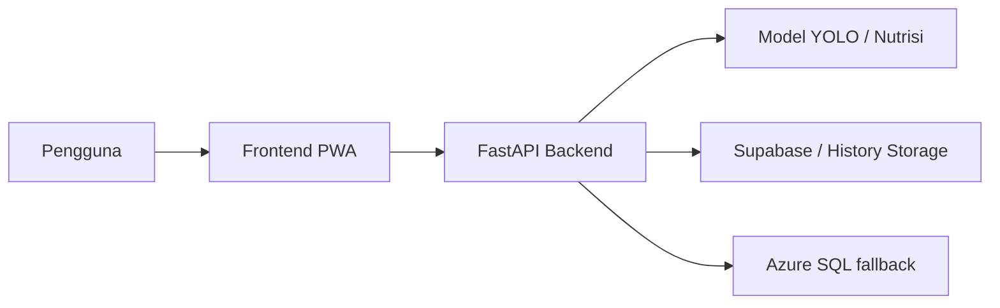

# SnapEats

Snap. Track. Eat Well.

SnapEats adalah Progressive Web App untuk mengenali makanan dari foto, menghitung nutrisi, dan menyimpan riwayat makan ke cloud. Aplikasi ini dibangun untuk membantu pengguna memantau asupan harian secara cepat tanpa pencatatan manual yang melelahkan.

## Latar Belakang

Pencatatan makanan secara manual cenderung lambat, tidak konsisten, dan sering ditinggalkan. Untuk pengguna yang ingin menjaga pola makan, cara ini membuat pemantauan kalori dan nutrisi menjadi sulit. SnapEats hadir sebagai solusi yang menggabungkan computer vision, backend FastAPI, dan penyimpanan cloud agar hasil scan bisa dipakai kembali sebagai riwayat yang rapi.

## Tujuan

Proyek ini bertujuan untuk:

1. Mengubah foto makanan menjadi ringkasan nutrisi yang mudah dibaca.
2. Menyimpan hasil scan ke riwayat agar bisa ditinjau ulang.
3. Menyediakan pengalaman web yang cepat, mobile-friendly, dan tetap nyaman dipakai di desktop.

## Gambaran Solusi



### Komponen Utama

- Frontend PWA: antarmuka scan, riwayat, dashboard, dan autentikasi.
- Backend FastAPI: API prediksi, kalkulasi nutrisi, dan penyimpanan riwayat.
- Supabase: penyimpanan utama untuk autentikasi dan history.
- Azure SQL: fallback backend untuk riwayat bila diperlukan.

## Fitur Utama

- Scan foto makanan dari galeri atau kamera.
- Deteksi makanan otomatis dengan model AI.
- Quick analytic nutrisi dengan basis porsi yang bisa diubah.
- Simpan hasil scan ke riwayat cloud.
- Riwayat makan yang bisa dikelompokkan per tanggal.
- Hapus riwayat dengan konfirmasi dan pop-up blur.
- Dashboard autentikasi yang mendukung keluar akun.
- Input menu manual untuk perhitungan nutrisi tanpa foto.

## Anggota Tim

| Nama | NIM |
|------|-----|
| Fadel Aulia Naldi | 23/519144/TK/57236 |
| Lalu Kevin Proudy Handal | 23/515833/TK/56745 |
| Mirsad Alganawi Azma | 23/522716/TK/57737 |
| Bintang Mahardika Shandy | 23/517449/TK/56919 |

## Struktur Repo

```text
backend/        FastAPI, model, dan helper database
frontend/       PWA berbasis Vite + React
scripts/        Helper start, build, dan packaging
tests/          Backend test dan e2e test
.github/        Workflow deployment
```

## Prasyarat

- Python 3.11+
- Node.js 18+
- npm
- Supabase project untuk auth dan history

## Menjalankan Lokal

### Backend

```powershell
cd backend
python -m venv .venv
.venv\Scripts\activate
pip install -r requirements.txt
python -m uvicorn api:app --host 0.0.0.0 --port 8000 --reload
```

### Frontend

```powershell
cd frontend
npm install
npm run dev
```

### Helper script

```powershell
scripts\start-backend.cmd
scripts\start-frontend.cmd
```

## Environment Variables

### Frontend

```env
VITE_API_BASE_URL=http://localhost:8000
VITE_SUPABASE_URL=https://<YOUR-PROJECT>.supabase.co
VITE_SUPABASE_ANON_KEY=<YOUR_SUPABASE_ANON_KEY>
```

Jika Anda memakai publishable key dari Supabase, gunakan variabel publishable yang sesuai di frontend.

### Backend

```env
SUPABASE_URL=https://<YOUR-PROJECT>.supabase.co
SUPABASE_SERVICE_ROLE_KEY=<YOUR_SERVICE_ROLE_KEY>
PORT=8000
TORCH_FORCE_NO_WEIGHTS_ONLY_LOAD=1
MPLBACKEND=Agg
QT_QPA_PLATFORM=offscreen
DISPLAY=
MPLCONFIGDIR=/tmp/matplotlib
PYTHONUNBUFFERED=1
```

## Konfigurasi Supabase

1. Buat project Supabase.
2. Ambil `Project URL`, `anon key`, dan `service_role key` dari dashboard.
3. Jalankan schema riwayat pada tabel `meal_history` melalui SQL Editor.
4. Tambahkan redirect URL aplikasi ke konfigurasi Auth Supabase.

## Alur Penggunaan

1. Masuk atau daftar akun.
2. Buka halaman scan.
3. Upload foto makanan.
4. Tinjau quick analytic dan pilih kandidat tambahan bila perlu.
5. Simpan hasil scan ke riwayat.
6. Buka halaman riwayat untuk melihat data per tanggal atau menghapus entri tertentu.

## Testing

```powershell
cd frontend
npm run typecheck
npm run build

cd ..
python -m compileall backend
```

## Deployment

1. Jalankan `scripts/package_backend.ps1` untuk membuat `backend.zip`.
2. Deploy backend ke Azure App Service.
3. Deploy `frontend/dist` atau app frontend ke target hosting yang Anda gunakan.
4. Pastikan environment production mengarah ke backend dan Supabase yang benar.

## Kesimpulan

SnapEats menyatukan deteksi makanan berbasis AI, penyimpanan riwayat cloud, dan antarmuka PWA yang ringan agar pencatatan nutrisi menjadi lebih cepat, lebih jelas, dan lebih mudah dipakai sehari-hari.
