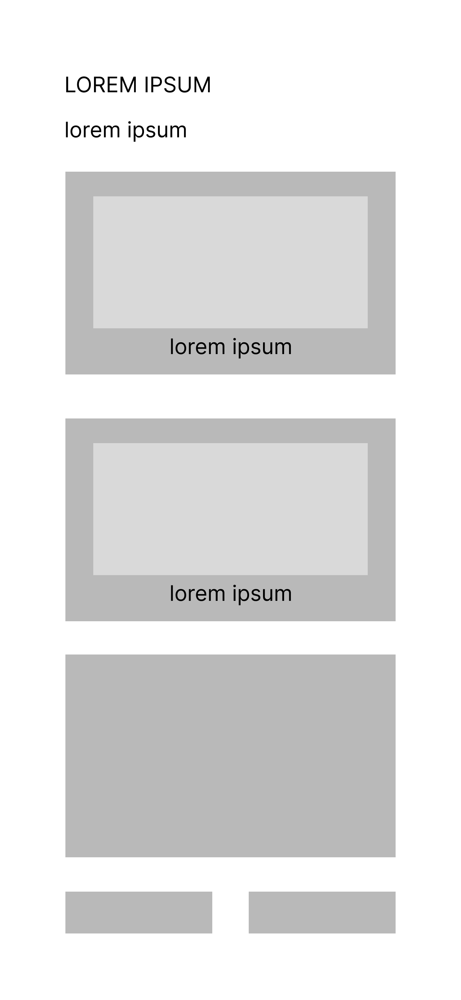
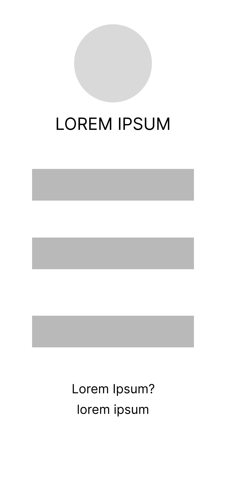
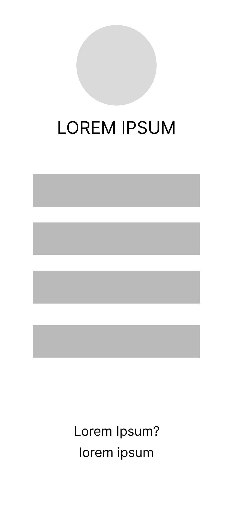

# SnapEats
> Snap. Eat Smart. Live Healthy.

---

## Kelompok King Em Yu
**Project Senior Project TI**
Departemen Teknologi Elektro dan Teknologi Informasi, Fakultas Teknik, Universitas Gadjah Mada

### Anggota Kelompok

| Nama | NIM | Peran |
|------|-----|-------|
| Fadel Aulia Naldi | 23/519144/TK/57236 | Project Manager & AI Engineer |
| Lalu Kevin Proudy Handal | 23/515833/TK/56745 | UI/UX Designer |
| Mirsad Alganawi Azma | 23/522716/TK/57737 | Software Engineer |
| Bintang Mahardika Shandy | 23/517449/TK/56919 | Cloud Engineer |

---

## Nama & Jenis Produk
**SnapEats** — Progressive Web App (PWA)

Dipilih karena PWA dapat diakses lintas platform (Android, iOS, Desktop) tanpa perlu install dari app store, sehingga memperluas jangkauan pengguna dan mempermudah proses deployment di Azure.

---

## Latar Belakang & Permasalahan

Berdasarkan data Riskesdas 2018, prevalensi obesitas di Indonesia meningkat menjadi **21,8%**. Masalah utama adalah sulitnya memantau asupan nutrisi harian karena metode pencatatan manual yang memakan waktu dan tidak praktis.

**Rumusan Masalah:**
Bagaimana menyediakan platform pemantau nutrisi otomatis berbasis AI yang mampu mengidentifikasi makanan secara real-time dengan latensi rendah melalui integrasi cloud?

---

## Ide Solusi & Rancangan Fitur

Aplikasi web progresif (PWA) yang menggunakan **Computer Vision** untuk deteksi makanan otomatis, di-deploy di **Azure App Service**, dan menggunakan **Azure SQL** untuk penyimpanan riwayat nutrisi.

| Fitur | Keterangan |
|-------|-----------|
| **Instant Snap-AI** | Foto makanan → deteksi kalori otomatis via AI |
| **Azure Health Log** | Sinkronisasi riwayat makan ke cloud secara real-time |
| **Nutri-Dash** | Visualisasi grafik makronutrisi harian & mingguan |

---

## Analisis Kompetitor

| Kompetitor | Jenis | Kelebihan | Kekurangan | Keunggulan SnapEats |
|-----------|-------|-----------|------------|---------------------|
| MyFitnessPal | Direct | Database global luas, komunitas kuat | Input manual, iklan di versi gratis | AI Image Recognition untuk makanan lokal Indonesia |
| FatSecret | Direct | Gratis, database lokal cukup baik | UI ketinggalan zaman, latensi tinggi | Azure Cloud → latensi rendah, UI modern |
| Google Lens | Indirect | Deteksi objek kuat, gratis | Tidak ada riwayat kesehatan/nutrisi | Manajemen database nutrisi personal terintegrasi |

---

## Metodologi SDLC: Agile

Kelompok kami memilih metodologi Agile dalam pengembangan SnapEats.

*Alasan Pemilihan:*
- Pengembangan model AI untuk deteksi makanan memerlukan iterasi dan perbaikan berkelanjutan
  berdasarkan hasil pengujian, sehingga Agile lebih cocok dibanding Waterfall yang kaku.
- Tim kecil (4 orang) dengan durasi 1 semester lebih efisien menggunakan sprint 2 mingguan
  agar setiap anggota dapat melihat progres nyata secara berkala.
- Agile memungkinkan penyesuaian fitur di tengah pengembangan apabila ditemukan kendala
  teknis, misalnya keterbatasan akurasi model AI atau perubahan skema database.
- Produk fungsional (MVP) dapat diuji lebih awal, sehingga ada waktu untuk perbaikan
  sebelum presentasi akhir semester.

---

## Tujuan Produk

SnapEats bertujuan untuk membantu masyarakat Indonesia — khususnya individu yang peduli terhadap kesehatan dan pola makan — dalam memantau asupan nutrisi harian secara otomatis dan akurat.

Produk ini menyelesaikan masalah pencatatan makanan yang selama ini memakan waktu dan tidak praktis, dengan memanfaatkan teknologi Computer Vision berbasis AI untuk mendeteksi jenis makanan dari foto secara real-time, lalu menyimpan riwayat konsumsi ke cloud agar dapat diakses kapan saja dan dari perangkat mana saja.

Dengan SnapEats, pengguna diharapkan dapat:
1. Memantau asupan kalori dan makronutrisi harian tanpa input manual.
2. Mengetahui pola makan mingguan melalui visualisasi data yang mudah dipahami.
3. Mengambil keputusan makan yang lebih sehat berdasarkan data nutrisi yang tercatat.

---

## Pengguna Potensial & Kebutuhan

### 1. Individu yang Menjalani Program Diet (Usia 18–35 Tahun)
*Deskripsi:* Pengguna yang secara aktif mengatur pola makan untuk menurunkan atau menjaga berat badan.
*Kebutuhan:*
- Cara cepat dan mudah mencatat makanan yang dikonsumsi tanpa mengetik manual.
- Informasi kalori dan makronutrisi yang akurat untuk setiap makanan.
- Rekap harian agar tahu apakah sudah melampaui batas kalori atau belum.

### 2. Pengguna dengan Kondisi Kesehatan Tertentu (Diabetes, Hipertensi)
*Deskripsi:* Individu yang perlu memantau asupan zat gizi tertentu (gula, garam, lemak) atas anjuran dokter atau ahli gizi.
*Kebutuhan:*
- Informasi kandungan gizi spesifik (karbohidrat, natrium, lemak jenuh).
- Riwayat konsumsi yang tersimpan untuk ditunjukkan ke dokter/ahli gizi.
- Peringatan atau indikator apabila asupan tertentu sudah berlebih.

### 3. Mahasiswa dan Pekerja dengan Mobilitas Tinggi
*Deskripsi:* Pengguna yang makan di luar rumah setiap hari dan tidak punya waktu untuk mencatat makanan secara manual.
*Kebutuhan:*
- Aplikasi yang cepat digunakan — cukup foto, langsung dapat info nutrisi.
- Dapat diakses dari HP tanpa perlu install aplikasi (PWA).
- Data tersinkronisasi otomatis ke cloud tanpa perlu backup manual.

### 4. Individu yang Ingin Memulai Hidup Sehat
*Deskripsi:* Pengguna baru yang belum terbiasa memantau nutrisi dan butuh panduan visual yang mudah dipahami.
*Kebutuhan:*
- Antarmuka yang sederhana dan tidak membingungkan.
- Visualisasi data yang informatif (grafik harian/mingguan).
- Dukungan makanan lokal Indonesia agar relevan dengan kebiasaan makan sehari-hari.

---

## Use Case Diagram

---

## Functional Requirements

Berdasarkan rancangan *Use Case Diagram*, berikut adalah kebutuhan fungsional sistem SnapEats:

| ID | Use Case | Deskripsi Kebutuhan Fungsional |
| :--- | :--- | :--- |
| **FR-01** | Register/Login | Sistem harus menyediakan fitur pendaftaran dan otentikasi masuk bagi pengguna. |
| **FR-02** | Logout | Sistem harus memiliki opsi yang memungkinkan pengguna untuk mengakhiri sesi aktif (keluar dari aplikasi). |
| **FR-03** | Upload Foto Makanan | Sistem harus memungkinkan pengguna untuk mengunggah foto makanan dari galeri atau kamera. |
| **FR-04** | Deteksi Makanan via AI | Saat foto diunggah, sistem utama harus memicu (*include*) proses pengiriman gambar ke *AI System* di *backend* untuk pengenalan makanan. |
| **FR-05** | Tampilkan Info Nutrisi | Sebagai kelanjutan (*include*) dari proses deteksi, sistem harus menampilkan rincian kalori dan makronutrisi dari makanan yang terdeteksi. |
| **FR-06** | Simpan Log Makan | Sistem harus menyediakan fungsi bagi pengguna untuk menyimpan hasil deteksi beserta nilai gizinya ke *database* sebagai log harian. |
| **FR-07** | Lihat Dashboard Nutrisi | Sistem harus dapat menarik data log makan pengguna dari *database* dan menampilkannya di halaman *dashboard*. |
| **FR-08** | Edit / Hapus Log Makan | Sistem harus memberi wewenang penuh kepada pengguna untuk mengubah detail atau menghapus entri riwayat makanan yang telah tersimpan. |

---

## Entity Relationship Diagram

---

## Low-Fidelity Wireframe

1. Dashboard

2. Login

3. Register

4. Log History

5. Result Page

6. Snap Page

---

## Gantt-Chart Pengerjaan Proyek

Berikut adalah alokasi jadwal pengerjaan proyek SnapEats dalam kurun waktu 1 semester (12 pertemuan):

| Kegiatan | 1 | 2 | 3 | 4 | 5 | 6 | 7 | 8 | 9 | 10 | 11 | 12 |
| :--- | :---: | :---: | :---: | :---: | :---: | :---: | :---: | :---: | :---: | :---: | :---: | :---: |
| **Brainstorming & Analisis Kebutuhan** | ██ | ██ | | | | | | | | | | |
| **Desain UI/UX PWA (Wireframe & Hi-Fi)** | | ██ | ██ | | | | | | | | | |
| **Pengumpulan Dataset & Anotasi AI** | | ██ | ██ | ██ | | | | | | | | |
| **Setup Infrastruktur Azure Cloud** | | | ██ | ██ | ██ | | | | | | | |
| **Pengembangan Model AI & Backend** | | | | ██ | ██ | ██ | ██ | | | | | |
| **Pengembangan Frontend PWA** | | | | ██ | ██ | ██ | ██ | ██ | | | | |
| **Integrasi Sistem (Frontend, AI, Cloud)** | | | | | | | | ██ | ██ | ██ | | |
| **Pengujian (UAT & Akurasi Model AI)** | | | | | | | | | | ██ | ██ | |
| **Deployment Akhir & Finalisasi** | | | | | | | | | | | ██ | ██ |